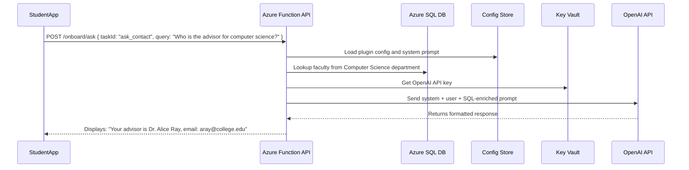

# CollegeAIDatbase

Here’s a **detailed use case** where an **Azure Function REST API** acts as a **pluggable OpenAI assistant** to support a **new student onboarding process** at a college, integrating with an **Azure SQL database** that holds **faculty and staff contact information**.

---

## 🎓 Use Case: AI-powered New Student Onboarding Assistant using Azure Function + OpenAI + Azure SQL (College Context)

---

### 🎯 **Business Goal**

The college wants to streamline **student onboarding** by allowing new students to ask onboarding-related questions via a self-service portal (web or mobile), and receive:

* Personalized answers (e.g., “Who is my academic advisor?”)
* Department-level contacts
* Orientation information
* Campus policies

The college already stores all faculty/staff data in an **Azure SQL Database** and wants to use **OpenAI to provide natural language responses** instead of hard-coded Q\&A or static forms.

---

## 🧩 **Solution Overview**

### 🔧 Key Technologies

* **Azure Function App**: Exposes a REST API (`/onboard/ask`)
* **Azure SQL Database**: Stores all faculty, staff, and department data
* **Azure Blob Storage or Table**: Stores task configs and prompt templates
* **Azure Key Vault**: Manages OpenAI API key securely
* **OpenAI GPT-4**: Generates contextual, student-friendly responses

---

### 🧬 Example Workflow: “Who do I contact for computer science advising?”



---

## 🧾 Azure SQL Schema (Simplified)

### 🧾 `FacultyContacts`

| id | name           | department       | title              | email                                       | phone    | location        |
| -- | -------------- | ---------------- | ------------------ | ------------------------------------------- | -------- | --------------- |
| 1  | Dr. Alice Ray  | Computer Science | Academic Advisor   | [aray@college.edu](mailto:aray@college.edu) | 555-1234 | Bldg C Room 210 |
| 2  | Prof. John Liu | Mathematics      | Head of Department | [jliu@college.edu](mailto:jliu@college.edu) | 555-5678 | Bldg A Room 101 |

---

## 📦 Plugin Config for `ask_contact` (Stored in Blob/Table)

```json
{
  "taskId": "ask_contact",
  "model": "gpt-4",
  "temperature": 0.4,
  "systemPrompt": "You are a friendly onboarding assistant at the college. Use the contact info provided to answer the student's question clearly and concisely. Mention only verified contacts.",
  "promptTemplate": "Student asked: {query}\n\nRelevant Contacts:\n{contactInfo}",
  "sqlQueries": [
    {
      "name": "contactInfo",
      "query": "SELECT name, title, email, phone, location FROM FacultyContacts WHERE department LIKE '%' + @department + '%'"
    }
  ],
  "inputFields": ["query"]
}
```

---

## 🧠 How the Prompt is Constructed

### 🧾 Student Input:

```json
{ "query": "Who do I talk to about computer science advising?" }
```

### 🧠 System Prompt:

> You are a friendly onboarding assistant at the college. Use the contact info provided to answer the student's question clearly and concisely. Mention only verified contacts.

### 📊 Query Result (from SQL):

```
Dr. Alice Ray, Academic Advisor, aray@college.edu, 555-1234, Bldg C Room 210
```

### 📩 Final User Prompt Sent to OpenAI:

```
Student asked: Who do I talk to about computer science advising?

Relevant Contacts:
Dr. Alice Ray, Academic Advisor, aray@college.edu, 555-1234, Bldg C Room 210
```

---

## 💡 Sample OpenAI Response

> For computer science advising, you should contact **Dr. Alice Ray**, Academic Advisor.
>
> * 📧 Email: [aray@college.edu](mailto:aray@college.edu)
> * 📞 Phone: 555-1234
> * 📍 Office: Building C, Room 210

---

## 🔐 Security & Governance

| Feature                 | Implementation                                         |
| ----------------------- | ------------------------------------------------------ |
| 🔐 **Key Management**   | OpenAI API Key in Azure Key Vault                      |
| 🎓 **FERPA Compliance** | Avoids returning student data                          |
| 🛡️ **Rate Limiting**   | Enforced via Azure API Management                      |
| 📊 **Audit Logging**    | All requests/responses logged via Application Insights |

---

## 🔧 Optional Enhancements

| Feature                       | Benefit                                                   |
| ----------------------------- | --------------------------------------------------------- |
| 🗂️ **Department Synonyms**   | NLP-powered synonyms to match "CS", "Comp Sci", etc.      |
| 📚 **Student Knowledge Base** | Add policies, class schedules, etc. to SQL or Blob        |
| 🧠 **Chat History**           | Store chat logs per student to personalize future replies |
| 🌍 **Multilingual Support**   | Add system prompts for Spanish, French, etc.              |
| 📅 **Event Info**             | Include orientation date and time dynamically from SQL    |

---

## ✅ Benefits Summary

| Goal                        | How This Architecture Delivers               |
| --------------------------- | -------------------------------------------- |
| Personalized onboarding     | Combines student question + SQL contacts     |
| Natural interaction         | GPT-powered conversational UI                |
| Centralized data usage      | Pulls real-time contact info from SQL        |
| Modular prompt control      | Easily add tasks via plugin configs          |
| Scalable and cost-efficient | Serverless backend with OpenAI on-demand use |

---

Set Up Steps 

Creating a serverless API using Azure that leverages Service Bus to communicate with an SQL Database involves several steps. Here's a high-level overview of how you can set this up:

1. **Set Up Azure SQL Database**:
   - Create an Azure SQL Database instance.
   - Set up the necessary tables and schemas you'll need for your application.

2. **Create Azure Service Bus**:
   - Set up an Azure Service Bus namespace.
   - Within the namespace, create a queue or topic (based on your requirement).

3. **Deploy Serverless API using Azure Functions**:
   - Create a new Azure Function App.
   - Develop an HTTP-triggered function that will act as your API endpoint.
   - In this function, when data is received, send a message to the Service Bus queue or topic.

4. **Deploy 2 Service Bus Triggered Function**:
   - Create another Azure Function that is triggered by the Service Bus queue or topic.
   - This function will read the message from the Service Bus and process it. The processing might involve parsing the message and inserting the data into the Azure SQL Database.

5. **Deploy a Timer Triggered Function**:
   - Create another Azure Function that is triggered when a file is dropped in a container.
   - This function will stream in a file, read it and place on the service bus topic.

6. **Implement Error Handling**:
   - Ensure that you have error handling in place. If there's a failure in processing the message and inserting it into the database, you might want to log the error or move the message to a dead-letter queue.

7. **Secure Your Functions**:
   - Ensure that your HTTP-triggered function (API endpoint) is secured, possibly using Azure Active Directory or function keys.

8. **Optimize & Monitor**:
   - Monitor the performance of your functions using Azure Monitor and Application Insights.
   - Optimize the performance, scalability, and cost by adjusting the function's plan (Consumption Plan, Premium Plan, etc.) and tweaking the configurations.

9. **Deployment**:
   - Deploy your functions to the Azure environment. You can use CI/CD pipelines using tools like Azure DevOps or GitHub Actions for automated deployments.

By following these steps, you'll have a serverless API in Azure that uses Service Bus as a mediator to process data and store it in an SQL Database. This architecture ensures decoupling between data ingestion and processing, adding a layer of resilience and scalability to your solution.


## Appplication Setting 

|Key|Value | Comment|
|:----|:----|:----|
|AzureWebJobsStorage|[CONNECTION STRING]|RECOMMENDATION :  store in AzureKey Vault.|
|ConfigurationPath| [CONFIGURATION FOLDER PATH] |Folder is optional
|ApiKeyName|[API KEY NAME]|Will be passed in the header  :  the file name of the config.
|AppName| [APPLICATION NAME]| This is the name of the Function App, used in log analytics|
|StorageAcctName|[STORAGE ACCOUNT NAME]|Example  "AzureWebJobsStorage"|
|ServiceBusConnectionString|[SERVICE BUS CONNECTION STRING]|Example  "ServiceBusConnectionString".  Recommmended to store in Key vault.|
|DatabaseConnection|[DATABASE CONNECTION STRING]|Example  "DatabaseConnection". Recommmended to store in Key vault.|
|TimerInterval|[TIMER_INTERVAL]|Example  "0 */1 * * * *" 1 MIN|


> **Note:**  Look at the configuration file in the **Config** Folder and created a Table to record information.

## Configuration Files 

> **Note:** The **Configuration** is located in the  FunctionApp  in a **Config** Folder.

|FileName|Description|
|:----|:----|
|99F77BEF300E4660A63A939ADD0BCF68.json| **Upload File** Parse CSV file --> Write Batched Files To Storage|
|43EFE991E8614CFB9EDECF1B0FDED37A.json| **File Parser** Parse CSV file --> File received from SFTP will use this process to parse files|
|43EFE991E8614CFB9EDECF1B0FDED37D.json| **Upload File** Parse JSON/CSV Directly to NO SQL DB|
|43EFE991E8614CFB9EDECF1B0FDED37C.json| **Service Bus Trigger for SQL DB** | Receive JSON payload and insert into SQL DB|
|43EFE991E8614CFB9EDECF1B0FDED37F.json| **Service Bus Trigger for No SQL DB** | Receive JSON payload and insert into NO SQL DB|
|43EFE991E8614CFB9EDECF1B0FDED37E.json| **Blob Trigger** Send parsed/sharded file  to Send to Service Bus|
|43EFE991E8614CFB9EDECF1B0FDED37B.json| **Search Resullt from NO SQLDB** |
|43EFE991E8614CFB9EDECF1B0FDED37G.json| **Search SQL DB. Return resultset** |
|3FB620B0E0FD4E8F93C9E4D839D00E1E.json| **Copy File from SFTP into the pickup folder** |
|3FB620B0E0FD4E8F93C9E4D839D00E1F.json| **Create a new Record in NoSQL Database** |
|CC244934898F46789734A9437B6F76CA.json| Encode Payload Request |
|6B427917E36A4DA281D57F9A64AD9D55.json| Get reports from DB  |


> Create the following blob containers and share in azure storage

|ContainerName|Description|
|:----|:----|
|config|Location for the configuration files|
|pickup|Thes are files that are copied from the SFTP share and dropped in the pickup container |
|processed|These are files the have been parsed and dropped in th processed container|

|Table|Description|
|:----|:----|
|csvbatchfiles|Track the CSV parsed files|
|training[YYYYMMDD]|N0 SQL DataStore|


|Share|Description|
|:----|:----|
|training[YYYYMMDD]|Create a share location for SFTP to drop files|

## Service Bus Subscription information

|Subscription Name|Description|
|:----|:----|
|request|Create a Topic|
|nosqlmessage|Create a Subscription|
|sqlmessage|Create a Subscription|
