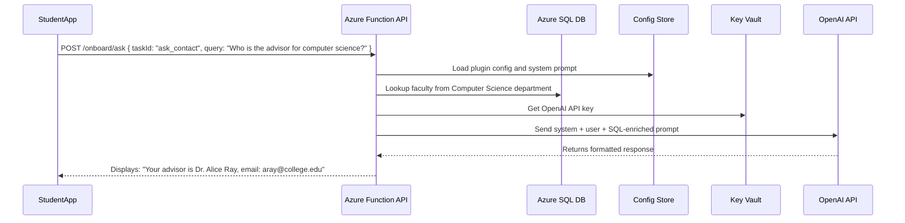

# CollegeAIDatbase

Here’s a **detailed use case** where an **Azure Function REST API** acts as a **pluggable OpenAI assistant** to support a **new student onboarding process** at a college, integrating with an **Azure SQL database** that holds **faculty and staff contact information**.

---

## 🎓 Use Case: AI-powered New Student Onboarding Assistant using Azure Function + OpenAI + Azure SQL (College Context)

---

### 🎯 **Business Goal**

The college wants to streamline **student onboarding** by allowing new students to ask onboarding-related questions via a self-service portal (web or mobile), and receive:

* Personalized answers (e.g., “Who is my academic advisor?”)
* Department-level contacts
* Orientation information
* Campus policies

The college already stores all faculty/staff data in an **Azure SQL Database** and wants to use **OpenAI to provide natural language responses** instead of hard-coded Q\&A or static forms.

---

## 🧩 **Solution Overview**

### 🔧 Key Technologies

* **Azure Function App**: Exposes a REST API (`/onboard/ask`)
* **Azure SQL Database**: Stores all faculty, staff, and department data
* **Azure Blob Storage or Table**: Stores task configs and prompt templates
* **Azure Key Vault**: Manages OpenAI API key securely
* **OpenAI GPT-4**: Generates contextual, student-friendly responses

---

### 🧬 Example Workflow: “Who do I contact for computer science advising?”



---

## 🧾 Azure SQL Schema (Simplified)

### 🧾 `FacultyContacts`

| id | name           | department       | title              | email                                       | phone    | location        |
| -- | -------------- | ---------------- | ------------------ | ------------------------------------------- | -------- | --------------- |
| 1  | Dr. Alice Ray  | Computer Science | Academic Advisor   | [aray@college.edu](mailto:aray@college.edu) | 555-1234 | Bldg C Room 210 |
| 2  | Prof. John Liu | Mathematics      | Head of Department | [jliu@college.edu](mailto:jliu@college.edu) | 555-5678 | Bldg A Room 101 |

---

## 📦 Plugin Config for `ask_contact` (Stored in Blob/Table)

```json
{
  "taskId": "ask_contact",
  "model": "gpt-4",
  "temperature": 0.4,
  "systemPrompt": "You are a friendly onboarding assistant at the college. Use the contact info provided to answer the student's question clearly and concisely. Mention only verified contacts.",
  "promptTemplate": "Student asked: {query}\n\nRelevant Contacts:\n{contactInfo}",
  "sqlQueries": [
    {
      "name": "contactInfo",
      "query": "SELECT name, title, email, phone, location FROM FacultyContacts WHERE department LIKE '%' + @department + '%'"
    }
  ],
  "inputFields": ["query"]
}
```

---

## 🧠 How the Prompt is Constructed

### 🧾 Student Input:

```json
{ "query": "Who do I talk to about computer science advising?" }
```

### 🧠 System Prompt:

> You are a friendly onboarding assistant at the college. Use the contact info provided to answer the student's question clearly and concisely. Mention only verified contacts.

### 📊 Query Result (from SQL):

```
Dr. Alice Ray, Academic Advisor, aray@college.edu, 555-1234, Bldg C Room 210
```

### 📩 Final User Prompt Sent to OpenAI:

```
Student asked: Who do I talk to about computer science advising?

Relevant Contacts:
Dr. Alice Ray, Academic Advisor, aray@college.edu, 555-1234, Bldg C Room 210
```

---

## 💡 Sample OpenAI Response

> For computer science advising, you should contact **Dr. Alice Ray**, Academic Advisor.
>
> * 📧 Email: [aray@college.edu](mailto:aray@college.edu)
> * 📞 Phone: 555-1234
> * 📍 Office: Building C, Room 210

---

## 🔐 Security & Governance

| Feature                 | Implementation                                         |
| ----------------------- | ------------------------------------------------------ |
| 🔐 **Key Management**   | OpenAI API Key in Azure Key Vault                      |
| 🎓 **FERPA Compliance** | Avoids returning student data                          |
| 🛡️ **Rate Limiting**   | Enforced via Azure API Management                      |
| 📊 **Audit Logging**    | All requests/responses logged via Application Insights |

---

## 🔧 Optional Enhancements

| Feature                       | Benefit                                                   |
| ----------------------------- | --------------------------------------------------------- |
| 🗂️ **Department Synonyms**   | NLP-powered synonyms to match "CS", "Comp Sci", etc.      |
| 📚 **Student Knowledge Base** | Add policies, class schedules, etc. to SQL or Blob        |
| 🧠 **Chat History**           | Store chat logs per student to personalize future replies |
| 🌍 **Multilingual Support**   | Add system prompts for Spanish, French, etc.              |
| 📅 **Event Info**             | Include orientation date and time dynamically from SQL    |

---

## ✅ Benefits Summary

| Goal                        | How This Architecture Delivers               |
| --------------------------- | -------------------------------------------- |
| Personalized onboarding     | Combines student question + SQL contacts     |
| Natural interaction         | GPT-powered conversational UI                |
| Centralized data usage      | Pulls real-time contact info from SQL        |
| Modular prompt control      | Easily add tasks via plugin configs          |
| Scalable and cost-efficient | Serverless backend with OpenAI on-demand use |

---

Would you like:

* A **SQL script to create the FacultyContacts table with sample data**?
* A **C# Function App sample with the SQL + OpenAI integration**?
* A **diagram of how this scales with API Management and monitoring**?

Let me know and I’ll build it out for you!
